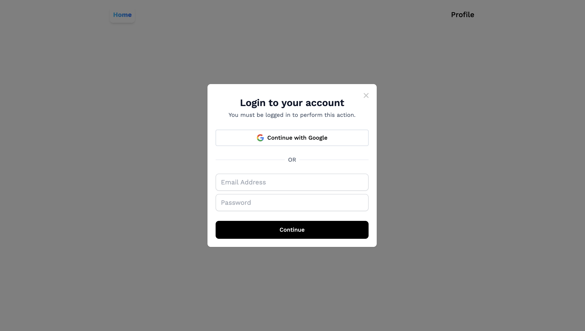
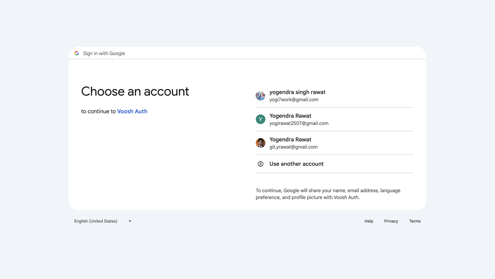
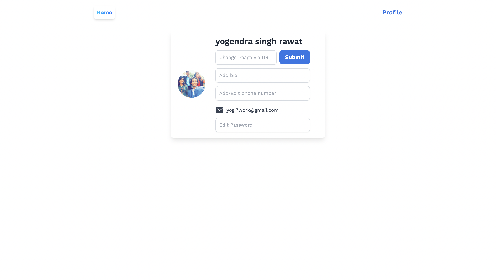

# User_Profile (Enhanced Authentication API)

This repository contains the implementation of the Enhanced Authentication API feature for our application. This feature enhances the security of user authentication, improving token generation mechanisms, and integrating OAuth2 authentication for third-party services.

## Features

- **Enhanced Token Generation:** Implementation of a more secure mechanism for generating authentication tokens to mitigate potential security risks.
- **OAuth2 Integration:** Integration of OAuth2 authentication for seamless third-party authentication, enhancing the application's versatility for integration with external services.

## Client





## Getting Started

To use this feature, follow these steps:

1. Clone the repository to your local machine:

   ```bash
   git clone https://github.com/Yogi0804/User_Profile.git
